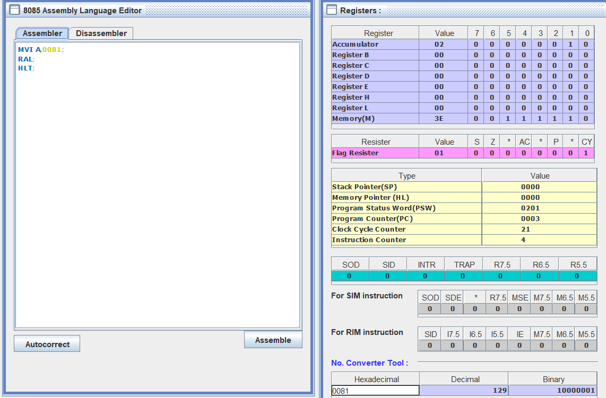

# Lab 3

---

## Aim :- TO EXPLORE AND ANALYZE LOGICAL INSTRUCTIONS AND BRANCH INSTRUCTIONS IN 8085.

---

## Practice Assignment

1. Explore following logical instructions of 8085

   ### CMC

    - Complement Carry
    - Syntax: `CMC`
    - Working : The CMC (Complement Carry) instruction in the 8085 microprocessor is used to complement
      (invert) the carry flag. If the carry flag is 1, the CMC instruction will change it to 0, and if the
      carry flag is 0, it will change it to 1. In simple terms, it toggles the carry flag.
    - 
    - 

   ### RLC

    - Rotate Accumulator Left
    - Syntax: `RLC`
    - Working: Each binary bit of the accumulator is rotated left by one position.
    - 

   ### RRC

    - Rotate Accumulator Right
    - Syntax: `RRC`
    - Working: The bit shifted out (from the least significant bit, LSB) is placed into the carry flag, and the
      carry flag's previous value is placed into the most significant bit (MSB) of the accumulator.
    - 

   ### RAL

    - Syntax: `RAL`
    - Working: Rotate the accumulator left through carry
    - 

   ### RAR

    - Syntax: `RAR`
    - Working: Rotate Accumulator Right through Carry
    - 

2. Explore following Branching instructions of 8085. JUMP (Unconditional and Conditional

   ### JMP

    - Jump
    - Syntax: `JMP addr`
    - Working: The JMP instruction is an unconditional jump instruction. It is used to transfer the control of the
      program to a specified memory location.

   ### JC AND JNC

    - JUMP if carry
    - JUMP if not carry
    - Working:
        - JC: The program sequence is transferred to a particular level or a 16-bit address if C=1 (or carry is 1)
        - JNC:The program sequence is transferred to a particular level or a 16-bit address if C=0 (or carry is 0)
    - 

   ### JZ AND JNZ

    - Working:
        - JZ: The program sequence is transferred to a particular level or a 16-bit address if Z=1 (or zero flag is 0)
        - JNZ: The program sequence is transferred to a particular level or a 16-bit address if Z=0 (or zero flag is 0)
        - 

---

## LAB ASSIGNMENT

1. Write an Assembly language program in 8085 to find whether the given number is even or odd. If the
   number is even, then store 01H at memory location 1110H, otherwise store 02H at the same location.
   ```ASSEMBLY
   MVI A,007F;
   START:
   RAR ;
   JC ODD;
   JC EVEN;
   EVEN:
   LXI H, 0110H
   MVI M,01H;
   ODD:
   LXI H, 0110H
   MVI M,02H;
   HLT;
   ```

---

2. Write an Assembly Language Program to load the Hexadecimal Numbers 9BH and A7H in Registers D and
   E respectively, and add the numbers. If the Sum is greater than FFH, then display 01H at the memory
   location 1000H, otherwise display the sum.
   ```ASSEMBLY
   MVI D,FFH;
   MOV A,D;
   MVI E,0001;
   START:
   ADD E;
   JC OVERFLOW;
   JNC OUTPUT;
   OVERFLOW:
   MVI A,FFH;
   STA 1000H;
   OUTPUT:
   STA 1001H;
   HLT;
   ```

---

3. Write an Assembly language program in 8085 to Count number of 1's of the content of the register D and
   store the count in the register C.
    - INPUT: DAH
    - OUTPUT: 5

- ```assembly
  MVI A,5CH;
  MOV B,A;
  CHECK:
  	RRC ;
  	JC INCREMENT
  	CONTINUE:
  	CMP B;
  	JZ END;
  	JMP CHECK;
  INCREMENT:
  	INR L;
  	JMP CONTINUE;
  END:
  MOV C,L;
  HLT;
  ```

---

4. Write an Assembly language program in 8085 to Move a block of 8 byte data stored from DF10H - DF17H
   to DF70H - DF77H.

- 8 Byte Block: 11,22,33,44,55,66,77,88
- ```assembly
    LXI H,DF10H       
    MVI C,08H         
    INIT: 
          MOV A,C 
          MOV M,A 
          INX H 
          DCR C 
          JNZ INIT  
          LXI H, DF10H
          LXI D, DF70H
          MVI C, 08H  
    MOVE: 
          MOV A,M 
          STAX D 
          INX H 
          INX D 
          DCR C 
          JNZ MOVE 
    HLT
   ```
---

5. Write an Assembly program in 8085 to multiply a given number by 2 using Rotate instructions.

- Left Shift Always means multiplying by 2
- ```
   MVI A,5CH;
   RAL;
   HLT;
   ```
---
> END OF DOCUMENT
