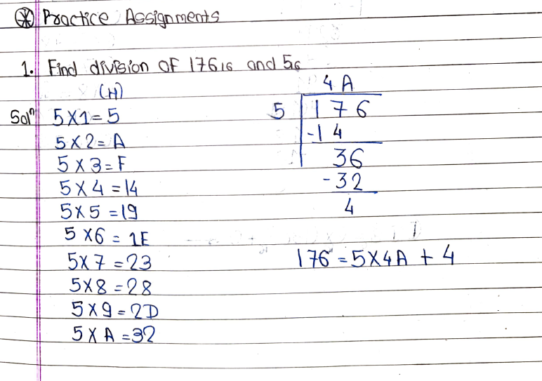
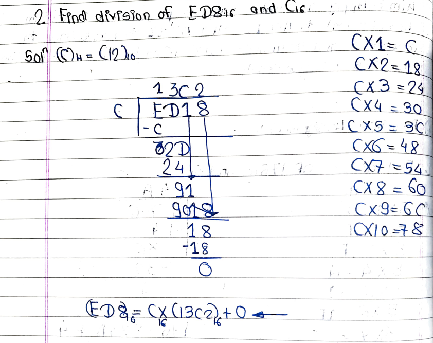

# LAB 6

**AIM:** Apply Assembly Language Programming to perform Hexadecimal to ASCII and ASCII to Hexadecimal conversions, and to analyze the logic behind Data Manipulation in the 8085 Microprocessor.

## Practice Assignment

- 
- 

## LAB ASSIGNMENT

**<u>Q.1</u>** A digital weighing machine uses a microprocessor to process sensor data. The sensor outputs the weight in hexadecimal format. To display this weight on a 7-segment digital display, it must be converted into its ASCII equivalent. Write an 8085 assembly language program to:

- Convert a 2-digit hexadecimal number stored in memory location 2000H into its ASCII representation.
- Store the converted ASCII characters at consecutive memory locations starting from 3000H. For example:
- If the hexadecimal input at 2000H is 4F, the ASCII output at 3000H and 3001H should be '4' (34H) and 'F' (46H), respectively.

<u>**Answer:**</u>

```asm
; Memory Initialization
MVI A, 4FH              ; Load input value in Accumulator
STA 2000H               ; Store the value in the memory

; Initialization
LDA 2000H               ; Load Accumulator with the input vlaue
MOV B, A                ; Store for later use

; Process the Lower number
ANI 0FH                 ; Get the Lower number
CPI 0AH                 ; Compare with 10 to check if it's greater or equal
JC LOWER_DIGIT          ; If less than 10 then it is a digit and convert it accordingly
ADI 37H                 ; Add 37H to convert 0xA-0xF to ASCII 'A'-'F'
JMP STORE_LSB           ; Store the value to memory

LOWER_DIGIT:
        ADI 30H         ; Add 30H to convert 0-9 to ASCII '0'-'9'

STORE_LSB:
        STA 3001H       ; Store the ASCII value at memory location 3001H

MOV A, B                ; Get the original Number

; Process the Higher number
RRC                     ; Rotate right to bring the number to lower bit position
RRC
RRC
RRC
ANI 0FH                ; Get the higher number
CPI 0AH                 ; Check if it's greater or equal to 10
JC UPPER_DIGIT          ; If less than 10 then it is a digit and convert it accordingly
ADI 37H                 ; Add 37H to convert 0xA-0xF to ASCII 'A'-'F'
JMP STORE_MSB           ; Store the value to memory

UPPER_DIGIT:
        ADI 30H         ; Add 30H to convert 0-9 to ASCII '0'-'9'

STORE_MSB:
        STA 3000H       ; Store the ASCII value at memory location 3000H

HLT                     ; Exit the program
```

**<u>Q.2</u>** A communication system uses a microprocessor to process user input before transmitting it over a network. The input is provided as a string of ASCII characters representing a hexadecimal number. Before transmission, the system must convert this ASCII-encoded hexadecimal string into its binary (hexadecimal) equivalent for efficient data transfer. Write an 8085 assembly language program to:

1. Read a 2-character ASCII string stored in memory locations 2000H and 2001H.
2. Convert these ASCII characters into a single hexadecimal value.
3. Store the resulting hexadecimal value in memory location 3000H.

Example:

- If the ASCII input at 2000H and 2001H is '4' (34H) and 'F' (46H), the program should produce the following: At memory location 3000H: Hexadecimal value 4F.

**Additional Details:**

1.  The ASCII input will always represent valid hexadecimal digits (0-9 and A-F in uppercase).
2.  Ensure that the program handles both numeric (0-9) and alphabetic (A-F) ASCII inputs correctly.
3.  Optimize the program for minimal instruction use.

<u>**Answer:**</u>

```asm
; Memory Initialization
MVI A, 34H              ; Load input value 1 in Accumulator
STA 2000H               ; Store the input value in memory
MVI A, 46H              ; Load input value 2 in Accumulator
STA 2001H               ; Store the input value in memory

; Process first character
LDA 2000H       ; Load the ASCII value to the Accumulator
CPI 41H         ; Compare with 'A' (41H)
JC NUMERIC_1    ; If less, it's a number
SUI 37H         ; Subtract 37H to convert 'A'-'F' to 0xA-0xF
JMP CONTINUE_1  ; Jump to CONTINUE_1

NUMERIC_1:
        SUI 30H         ; Subtract 30H to convert '0'-'9' to 0-9

CONTINUE_1:
        RLC             ; Rotate left 4 times to place in the upper nibble
        RLC
        RLC
        RLC
        MOV B, A        ; Store the converted higher nibble in register B

; Process second character
LDA 2001H       ; Load the ASCII value of the second character
CPI 41H         ; Compare with 'A' (41H)
JC NUMERIC_2    ; If less, it's a number
SUI 37H         ; Subtract 37H to convert 'A'-'F' to 0xA-0xF
JMP CONTINUE_2  ; Jump to CONTINUE_2

NUMERIC_2:
        SUI 30H         ; Subtract 30H to convert '0'-'9' to 0-9

CONTINUE_2:
        ADD B           ; Combine higher and lower nibbles

; Store the output in the memory
STA 3000H       ; Store the resulting hexadecimal value at memory location 3000H

HLT             ; Halt the program
```

**<u>Q.3</u>** Assume the user types in a series of characters (e.g., "HELLO"). The 8085 microprocessor will read these characters one by one and store them in memory. Explain how the ASCII values for each character (H, E, L, L, O) are represented in memory in hexadecimal format. Write an 8085 assembly program that stores the ASCII codes for the characters "HELLO" in memory, starting from a specific memory address (say, 4000H).

<u>**Answer:**</u>

```asm
LXI H, 400      ; Point the HL pair to point to starting location
MVI A, 48H      ; Store 'H' in Accumulator
MOV M, A        ; Move the value to the memory location
INX H           ; Increment HL pair to point to next location

MVI A, 45H      ; Store 'E' in Accumulator
MOV M, A        ; Move the value to the memory location
INX H           ; Increment HL pair to point to next location

MVI A, 4CH      ; Store 'L' in Accumulator
MOV M, A        ; Move the value to the memory location
INX H           ; Increment HL pair to point to next location

MOV M, A        ; Move the value to the memory location
INX H           ; Increment HL pair to point to next location

MVI A, 4FH      ; Store 'O' in Accumulator
MOV M, A        ; Move the value to the memory location

HLT             ; Exit the program
```
